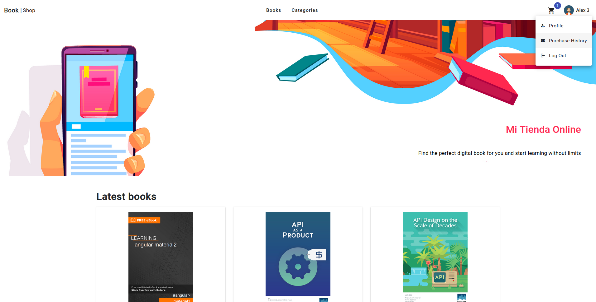
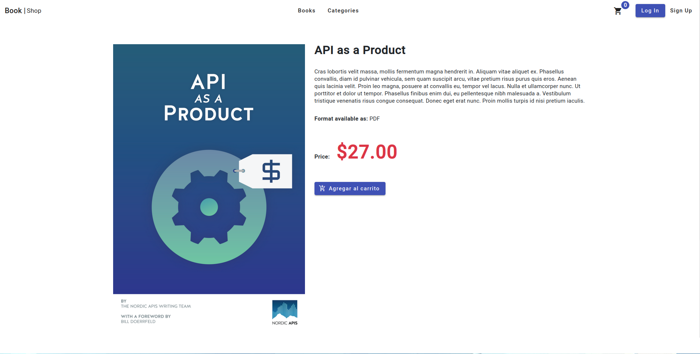
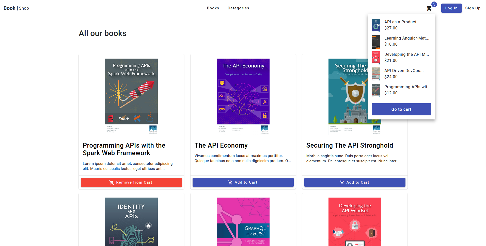
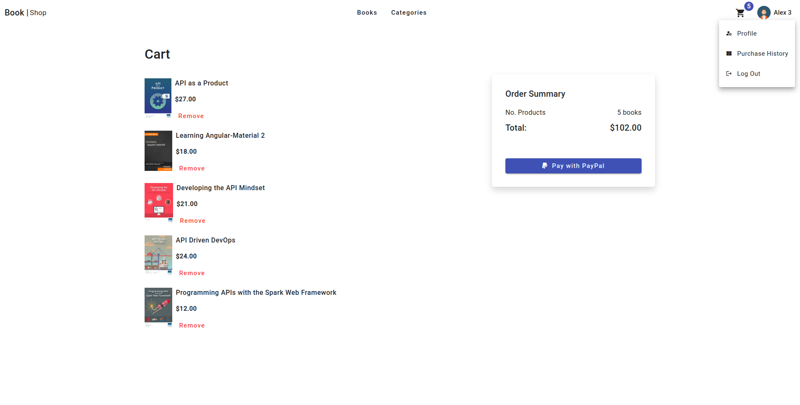
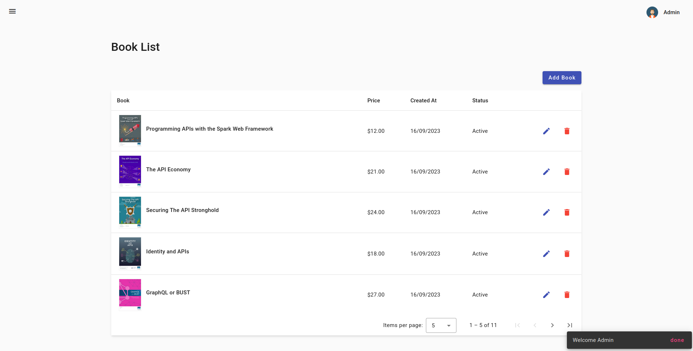
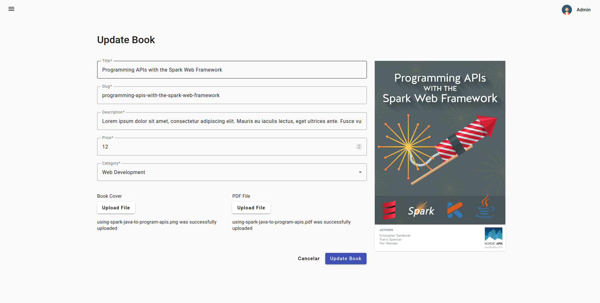
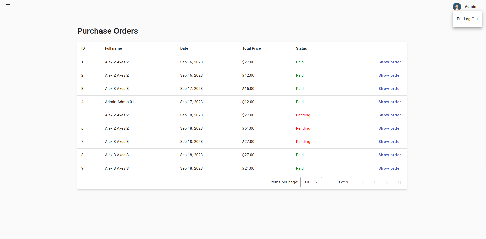

# Book | Shop

This project was generated with Angular CLI version 16.1.7.

## Features

⚡️ Angular 16\
⚡️ Spring Boot 3.0.10\
⚡️ Spring Security | JWT\
⚡️ PostgreSQL\
⚡ Docker

## Getting Started

### .env

Create `.env` file based on `.env.template`

### Run the development server with Docker 🐳 :

```bash
# run docker contaniers
docker compose up --build


# stop and remove containers & networks
docker compose down -v

```

## View demo

To see the real-time behavior you can log in with:

- Admin: `alex1@demo.com` and password `123qwe123QWE.`
- User: `alex2@demo.com` and password `123qwe123QWE.`

<a href="https://alx-storebook-angular-spring.netlify.app" target="_blank">Demo</a>

### Screenshots




|                                                          |                                                                       |
| :------------------------------------------------------: | :-------------------------------------------------------------------: |
|         |                         |
|  |                    |
|  |  |
